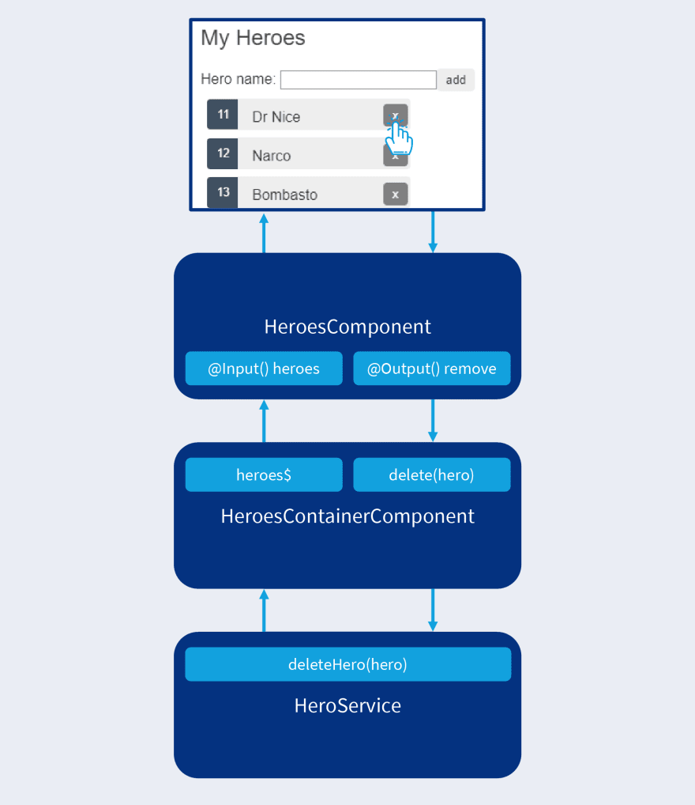

# Container (Smart) and Presentational (Dumb) Components

## Why

Imagine you build a component that deals with persistence layer and at the same time handles the UI state:

- Components built with many lines of code and responsibilities.
- Separation of concerns.

## Container Component

Container component can be think of it is like shipping containers:

- Contain all the state needed for presentational components in it is view.
- The template of a container component is made up entirely of presentational components and data bindings.
- Supply stream of observable data flow for presentational components.
- Connect to the presentational component with data bindings.
- Apply the `OnPush` change detection strategy.
- Deals with the the application state management (NgRx) and persistence layers (services) with dependency injection.
-

## Presentational Component

- Present application state to the user.
- Change application state triggered by user interaction.
- Have `@Input()` decorator for supplying them with data which will be formatted for display.
- Use `@Output()` decorator to notify application state changes initiated by user interactions.
- Apply the `OnPush` change detection strategy.
- Usually reusable.
- No side effects.

## Communication Between Container and Presentational Component

Container and presentational component communicate with each other via the `@Input()` and `@Output()` decorators in the presentational component.

Presentational component can have as many `@Input()` and `@Output()` decorators as it needs for different responsibility.



## Naming

To have `.container` suffix instead of `.component` for container component.

```
heroes
|-heroes.component.ts
|-heroes.component.html
|-heroes.component.scss
|-heroes.container.ts
|-heroes.container.html
|-heroes.container.scss
```

## Hands On

### Prerequisite

1. `git clone https://github.com/hongtat88/angular-workshop.git`
2. Navigate into `smart-and-dumb-components\starter-kit` directory
3. `npm install`
4. `npm start`

> 📝 Note: You could always find the final solution in `smart-and-dumb-components\final` directory.

### Extract a Container and Presentational Component out of a Mixed Component

1. First, let's generate a new container component:

```
ng generate component heroes/heroes --skip-tests  --flat --type=container --selector=app-heroes-container
```

2. Open the newly created container component and import the `heroService` in the constructor.

```
constructor(private heroService: HeroService) {}
```

3. Create a new `heroes$` Observable that will be use in `heroes.component` presentation component later.

```
heroes$ = this.heroService.heroes$;
```

4. Create a new function for `addHero()` action.

```
addHero(heroName: string): void {
    this.heroService.addHero(heroName);
}
```

5. Now, we could apply the `OnPush` change detection strategy at the `@Component()` decorator.

```
changeDetection: ChangeDetectionStrategy.OnPush
```

6. Open the `heroes.container.html`, and change it to use the existing `heroes.component` and that will be the new presentational component.

```
<app-heroes
  *ngIf="heroes$ | async as heroes"
  [heroes]="heroes"
  (onAddHero)="addHero($event)"
></app-heroes>
```

7. Go to `app.component.html` and change to use the container component instead:

```
<app-heroes-container></app-heroes-container>

```

8. We are at the half way, now let's move on to the `heroes.component.ts` which is the new presentational component.

9. At the `heroes.component.ts`, let's create a new `@Input()` decorator that will be providing data into this presentational component.

```
@Input() heroes!: Hero[];
```

10. Then, let's create a new `@Output()` decorator that responsible to notify container component that it wants to add a new hero to the table.

```
@Output() onAddHero = new EventEmitter<string>();
```

11. We now could remove the existing `heroes$` Observable since the data now flows in through the `@Input() heroes$` decorator.

12. At the `addHero()` function, instead of calling the `heroService` directly to add the new hero. Now we could emit the `@Output() onAddHero` instead:

```
addHero(heroForm: NgForm): void {
    this.onAddHero.emit(heroForm.value.name);
}
```

13. We can now remove the `heroService` dependency at the constructor.

14. Let's apply the `OnPush` change detection strategy at the `@Component()` decorator as well.

```
changeDetection: ChangeDetectionStrategy.OnPush
```

15. The final piece of the puzzle, let's open up the `heroes.component.html` and remove the `heroes$ | async` Observable and the `*ngIf` directive. Because we no longer rely on this.

16. And that's it! We successfully converted it to using the container and presentational components `ng serve` the project and it should works just like before.
